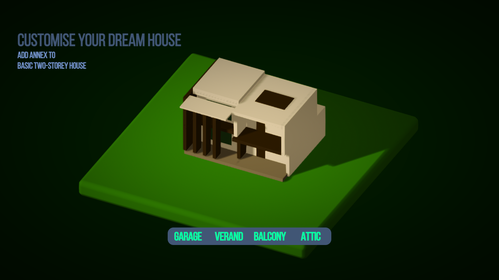

# Dream-House



## Project setup
```
npm install
```

### Compiles and hot-reloads for development
```
npm run serve
```

### Compiles and minifies for production
```
npm run build
```

### Lints and fixes files
```
npm run lint
```

### File server (for models)
```
npm install http-server -g
```
```
http-server src/assets
```

### Customize configuration
See [Configuration Reference](https://cli.vuejs.org/config/).
